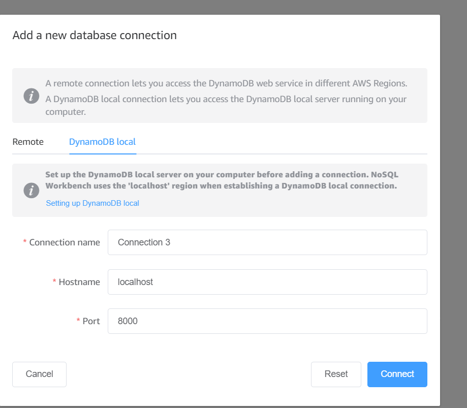

# Serverless Framework AWS NodeJS Example

This template demonstrates how to deploy a NodeJS function running on AWS Lambda using the traditional Serverless Framework. The deployed function does not include any event definitions as well as any kind of persistence (database). For more advanced configurations check out the [examples repo](https://github.com/serverless/examples/) which includes integrations with SQS, DynamoDB or examples of functions that are triggered in `cron`-like manner. For details about configuration of specific `events`, please refer to our [documentation](https://www.serverless.com/framework/docs/providers/aws/events/).

## Usage

### Deployment

In order to deploy the example, you need to run the following command:

```
$ serverless deploy
```

After running deploy, you should see output similar to:

```bash
Deploying aws-node-project to stage dev (us-east-1)

✔ Service deployed to stack aws-node-project-dev (112s)

functions:
  hello: aws-node-project-dev-hello (1.5 kB)
```

### Invocation

After successful deployment, you can invoke the deployed function by using the following command:

```bash
serverless invoke --function hello
```

Which should result in response similar to the following:

```json
{
    "statusCode": 200,
    "body": "{\n  \"message\": \"Go Serverless v3.0! Your function executed successfully!\",\n  \"input\": {}\n}"
}
```

### Local development

You can invoke your function locally by using the following command:

```bash
serverless invoke local --function hello
```

Which should result in response similar to the following:

```
{
    "statusCode": 200,
    "body": "{\n  \"message\": \"Go Serverless v3.0! Your function executed successfully!\",\n  \"input\": \"\"\n}"
}
```

### Serverless Offline
```bash
 sls offline
```
This [Serverless plugin](https://www.serverless.com/plugins/serverless-offline) emulates AWS λ and API Gateway on your local machine to speed up your development cycles.
This will expose the API endpoints to test out locally.

```bash
Function names exposed for local invocation by aws-sdk:
           * hello: product-management-dev-hello

   ┌─────────────────────────────────────────────────────────────────────────┐
   │                                                                         │
   │   GET | http://localhost:3000/hello                                     │
   │   POST | http://localhost:3000/2015-03-31/functions/hello/invocations   │
   │                                                                         │
   └─────────────────────────────────────────────────────────────────────────┘

Server ready: http://localhost:3000 🚀
```

### Dynamodb Local

1. Install the dynamodb local using:

```bash
sls dynamodb install
```

2. Run the dynamodb local

```bash
sls dynamodb start
```

```
Running "serverless" from node_modules
Dynamodb Local Started, Visit: http://localhost:8000/shell
```

3. Add connection in NoSQL Workbench
   